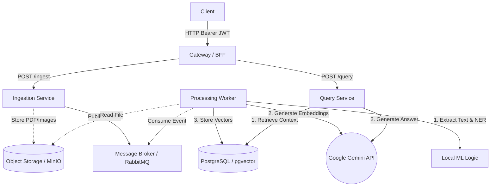

# Architecture Overview

This document outlines the high-level architecture of the AI-powered Document Insight Platform, detailing component responsibilities, data flows, and fundamental design trade-offs.

## System Diagram

The following logical diagram illustrates the main components of the system and how they interact.

## Component Responsibilities

1. **Gateway / Backend-For-Frontend (BFF)**
   - Acts as the single entry point for all client requests.
   - Handles stateless JWT authentication verification.
   - Implements per-user rate limiting to protect the system from abuse.
   - Routes validated requests to the underlying microservices.

2. **Ingestion Service**
   - Receives raw unstructured documents (PDFs, images).
   - Validates file constraints (e.g., filesize limits).
   - Persists the original document blob directly to Object Storage (MinIO or AWS S3).
   - Immediately acknowledges the client request and emits a `document_uploaded` event to the RabbitMQ broker for asynchronous processing.

3. **Processing Worker (Python / FastAPI / Celery equivalent)**
   - De-coupled daemon that listens to RabbitMQ for new document events.
   - Retrieves the raw document from Object Storage.
   - Executes heavy local computation: Optical Character Recognition (OCR), parsing, and Named Entity Recognition (NER).
   - Generates high-quality vector embeddings using the external Google Gemini API.
   - Persists the resulting embeddings and metadata into PostgreSQL via the `pgvector` extension, ensuring the data includes a `tenant_id` column for security isolation.

4. **Query Service**
   - Exposes REST endpoints to query the ingested knowledge base.
   - Receives a user question, applying tenant-specific filters.
   - Queries the PostgreSQL DB for the most relevant context chunks (Retrieval-Augmented Generation context).
   - Synthesizes an answer using the Google Gemini API based on the retrieved context, returning confidence scores, quoted sources, and detected entities back to the Gateway.

## Data Flow

### 1. Ingestion Flow (Asynchronous)
1. **User Request:** The client sends an authorized POST request (`/ingest`) containing a file payload.
2. **Gateway:** Validates JWT, checks rate limits, and forwards to the Ingestion Service.
3. **Storage:** The Ingestion Service securely streams the file to Object Storage, obtaining a URL/URI.
4. **Event Trigger:** An event containing the file URI and tenant metadata is pushed to a RabbitMQ queue.
5. **Immediate Response:** The user receives a `202 Accepted` response.
6. **Background Processing:** The Worker dequeues the event, downloads the file, processes text/NER, fetches embeddings from the LLM, and stores the chunks in the PostgreSQL database keyed by `tenant_id`.
7. **Retrieval:** The Query Service converts the question into an embedding via the LLM API, and SQL queries the pgvector extension for similar chunks, strictly passing the user's `tenant_id` in the `WHERE` clause.
8. **Answer Generation:** The most relevant chunks are batched into a prompt alongside the original question. The Gemini API generates a concise response.
9. **Result:** The computed answer, confidence scores, and source citations are returned synchronously to the client.

### 2. Query Flow (Synchronous)
1. **User Request:** The client sends a question via POST (`/query`).
2. **Gateway:** Authenticates request and routes to Query Service.

## Design Trade-offs

1. **Fully Asynchronous Ingestion vs. Immediate Availability**
   - *Trade-off:* Opted for immediate `202 Accepted` responses requiring clients to poll or rely on a generic asynchronous mindset over holding the HTTP connection open during text extraction.
   - *Reasoning:* Machine learning parsing of large PDFs takes significant time. Synchronous processing would lead to timeouts and degraded Gateway stability.

2. **Cloud LLM (Gemini API) vs. Self-hosted Open Source Models**
   - *Trade-off:* Relying on Google's API introduces latency for over-the-wire roundtrips, vendor lock-in, and compliance considerations vs. holding data entirely on-premise.
   - *Reasoning:* Allows rapid greenfield deployment, extremely high answer quality, and massive context windows without dedicating significant operational resources to manage and scale expensive GPU instances locally.

3. **PostgreSQL (pgvector) vs. Dedicated Vector DBs**
   - *Trade-off:* Self-hosted PostgreSQL with `pgvector` was chosen over a dedicated SaaS vector DB (like Pinecone) or standalone vector engine (like Qdrant).
   - *Reasoning:* PostgreSQL reduces infrastructure complexity by operating as a single source of truth for both relational metadata and vector embeddings. It runs perfectly in standard cluster environments and utilizes highly familiar SQL syntax for filtering and multi-tenancy.

4. **Microservices (Gateway/Ingestion/Query) vs. Majestic Monolith**
   - *Trade-off:* Operating multiple services via K8s introduces infrastructure overhead compared to a single FastAPI repository.
   - *Reasoning:* Decoupled boundaries allow the heavy Processing Worker and memory-intensive Ingestion Service to scale entirely independently of the CPU-light Query and Gateway components.
